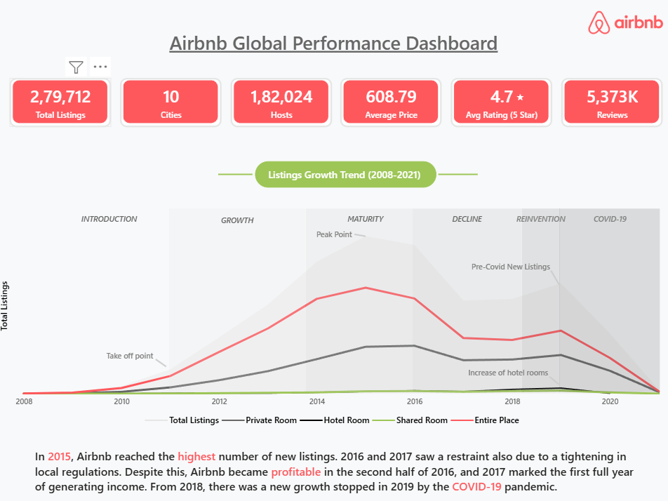
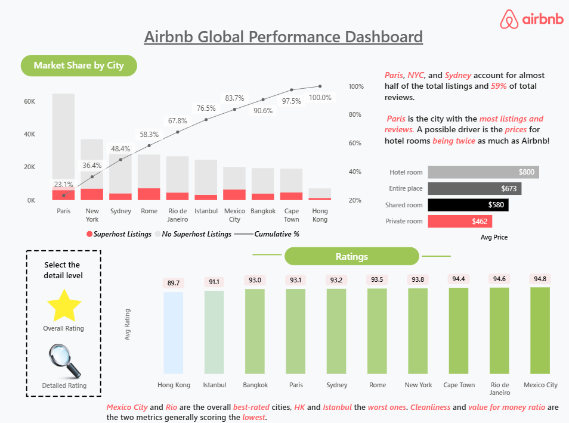
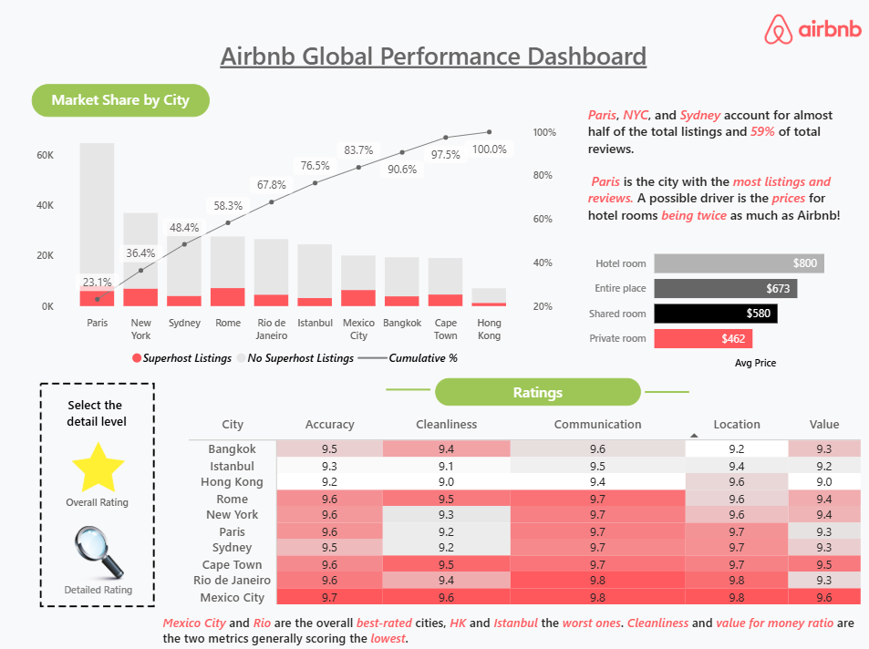
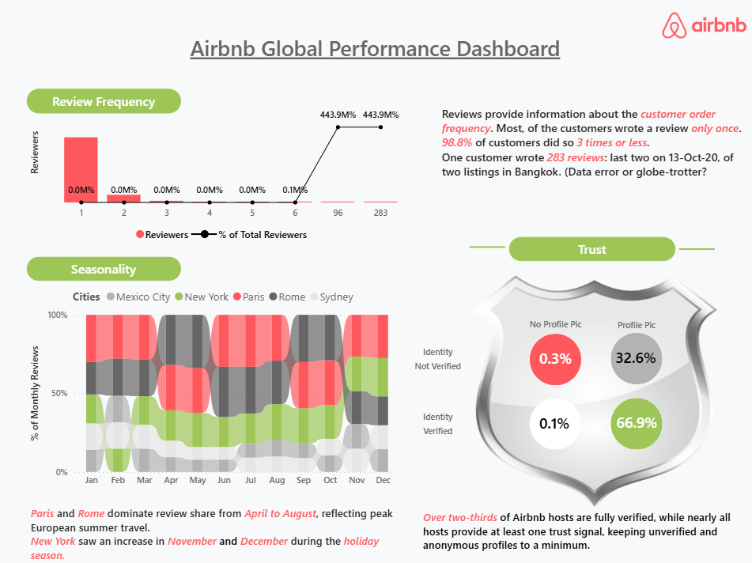

# 🏠 Airbnb Global Performance Dashboard

## 📌 Project Overview

The **Airbnb Global Performance Dashboard** is an interactive Power BI project designed to analyze Airbnb listings, hosts, reviews, ratings, pricing, seasonality, and trust metrics across major global cities.

This dashboard transforms raw Airbnb data into actionable business insights using **Power BI, DAX, Data Modeling, Bookmarks, and Data Visualization techniques**.

The project explores Airbnb's marketplace growth, customer review behavior, city-wise performance, host trust indicators, and listing characteristics to support data-driven decision-making.

---

## 🎯 Project Objectives

- Analyze Airbnb's global marketplace performance.
- Understand listing growth trends over time.
- Identify top-performing cities based on listings and reviews.
- Evaluate customer satisfaction through ratings analysis.
- Analyze review frequency patterns.
- Examine host trust and verification metrics.
- Compare pricing across room types.
- Discover seasonality trends in customer reviews.
- Build an executive-level interactive dashboard using Power BI.

---

## 🛠 Tools & Technologies Used

- Power BI
- Power Query
- DAX (Data Analysis Expressions)
- Data Modeling
- Data Visualization
- Bookmarks
- Interactive Navigation
- Business Intelligence

---

## 📊 Dashboard Overview

### Page 1: Overview

Provides a high-level summary of Airbnb's global performance.

#### Key Metrics

- Total Listings: 279,712
- Cities: 10
- Hosts: 182,024
- Property Types: 144
- Reviews: 5.37 Million

#### Key Insights

- Airbnb experienced rapid growth between 2011 and 2015.
- New listings peaked in 2015.
- Entire Place listings dominate the marketplace.
- Growth slowed due to regulatory restrictions during 2016–2017.
- COVID-19 significantly impacted listing growth after 2019.

---

### Page 2: Market Share & Ratings Analysis

#### Market Share by City

Analyzes:

- Listings distribution by city
- Superhost contribution
- Cumulative market share

#### Key Insights

- Paris, New York City, and Sydney account for a significant share of total listings.
- Paris has the highest number of listings and reviews.
- Market concentration is heavily skewed toward a few cities.

---

### ⭐ Interactive Ratings Analysis

This page includes **bookmark-based navigation** using custom visual buttons.

#### ⭐ Overall Rating View

Displays:

- Overall rating comparison across cities
- Best-rated and lowest-rated markets
- Executive-level performance overview

#### 🔍 Detailed Rating View

Displays:

- Accuracy
- Cleanliness
- Communication
- Location
- Value

through an interactive matrix visualization.

#### Interactive Features

- Star icon switches to Overall Rating View.
- Magnifying Glass icon switches to Detailed Rating View.
- Implemented using Power BI Bookmarks and Selection Pane.

#### Key Insights

- Mexico City and Rio de Janeiro are the highest-rated cities.
- Hong Kong and Istanbul have comparatively lower ratings.
- Cleanliness and Value generally receive lower scores than other rating dimensions.

---

### Page 3: Reviews & Trust Analysis

#### Review Frequency Analysis

Examines customer review behavior.

##### Key Insights

- Most customers leave only a few reviews.
- Approximately 98.8% of reviewers write between 1 and 3 reviews.
- A small number of users contribute unusually high review counts.

#### Seasonality Analysis

Examines monthly review patterns across cities.

##### Key Insights

- Paris and Rome dominate review activity during the European summer season.
- New York experiences increased review activity during November and December.

#### Host Trust Analysis

Analyzes:

- Identity Verification
- Profile Picture Availability

##### Key Insights

- Over two-thirds of Airbnb hosts are fully verified.
- Anonymous and unverified profiles represent a very small proportion of hosts.
- Trust indicators are strongly adopted across the platform.

---

## 📈 DAX Measures Implemented

### Listings Analysis

- Total Listings
- Hosts Total
- Avg Price
- Avg Rating
- City Rank
- Cumulative Listings
- Cumulative Percentage
- Entire Place Listings
- Private Room Listings
- Hotel Room Listings
- Shared Room Listings
- Superhost Listings
- No Superhost Listings

### Ratings Analysis

- Accuracy
- Cleanliness
- Communication
- Location
- Value

### Trust Analysis

- Verified Profile
- Verified No Profile
- Not Verified Profile
- Not Verified No Profile

### Reviews Analysis

- Total Reviews
- Reviewers
- Reviews per Reviewer
- Cumulative Reviewers
- Review Frequency Percentage
- Monthly Review Analysis

---

## 📌 Key Business Insights

### Marketplace Growth

- Airbnb experienced strong marketplace expansion until 2015.
- Regulatory restrictions slowed growth after 2016.
- COVID-19 caused a significant decline in listing growth.

### City Performance

- Paris is the leading city in terms of listings and reviews.
- A small number of cities contribute the majority of marketplace activity.

### Customer Satisfaction

- Mexico City and Rio de Janeiro receive the highest overall ratings.
- Cleanliness and value for money show opportunities for improvement.

### Pricing

- Hotel rooms have the highest average prices.
- Private rooms are the most affordable accommodation type.

### Customer Behavior

- Most users review Airbnb listings only a few times.
- Seasonal travel patterns significantly influence review activity.

### Trust & Safety

- The majority of hosts are identity verified.
- Profile completeness contributes positively to platform trust.

---

## 📂 Repository Structure

```text
Airbnb-Global-Performance-Dashboard/
│
├── Images/
│   ├── Color Palette.png
│   ├── Dotted Line rectangle.png
│   ├── Magnifying glass.png
│   ├── SHIELD.png
│   ├── Star.webp
│   └── air bnb logo.png
│
├── Overview.png
├── OverallRating.png
├── DetailedRating.png
├── Reviews.png
│
├── DAX Formulas for Airbnb Global Performance Dashboard.pdf
├── Listings_data_dictionary.csv
├── Reviews_data_dictionary.csv
│
├── PBIX Download Link.txt
└── README.md
```

---

## 📊 Dataset Source

This project uses the Airbnb Listings & Reviews dataset provided by Maven Analytics Data Playground.

### Dataset Details

The dataset contains information related to:

- Airbnb Listings
- Hosts
- Reviews
- Ratings
- Pricing
- Property Types
- Room Types
- Host Verification Status
- Customer Review Activity

### Dataset Link

🔗 Airbnb Listings & Reviews Dataset:

https://mavenanalytics.io/data-playground/airbnb-listings-reviews

### Dataset Provider

Maven Analytics Data Playground provides real-world datasets for data analysis, business intelligence, and visualization projects.

---

## 📷 Dashboard Screenshots

### Overview Dashboard



---

### Overall Ratings View



---

### Detailed Ratings View



---

### Reviews & Trust Analysis



---

## 📂 Power BI Dashboard File

The Power BI (.pbix) file is hosted externally due to GitHub file size limitations.

Please use the link provided in:

```text
PBIX Download Link.txt
```

to download the complete dashboard.

---

## 🚀 Skills Demonstrated

- Power BI Dashboard Development
- Data Modeling
- DAX
- Business Intelligence
- Data Visualization
- KPI Design
- Market Share Analysis
- Customer Behavior Analysis
- Ratings Analysis
- Review Frequency Analysis
- Trust & Verification Analysis
- Interactive Dashboard Design
- Power BI Bookmarks
- Executive Storytelling

---

## 👨‍💻 Author

**Abhishek Savita**

GitHub: https://github.com/Abhishek-Savita-3012

LinkedIn: https://www.linkedin.com/in/abhishek-savita-b41961276

---
⭐ If you found this project useful, consider giving the repository a star.
